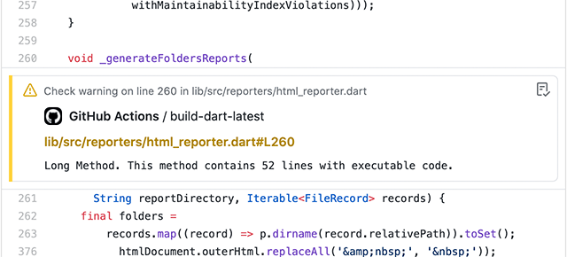

# GitHub reporter

Report about design and static code diagnostics issues in pull requests based on GitHub Actions Workflow commands.

1. Your git workflow must include/support flutter/dart
2. Add to your git workflow:
```
jobs:
  your_job_name:
    ...
    steps:
     ...
      - name: Run Code Metrics
        run: flutter pub run dart_code_metrics:metrics lib --reporter=github lib
        # OR
        # run: dart pub run dart_code_metrics:metrics lib --reporter=github lib
```

---



---
