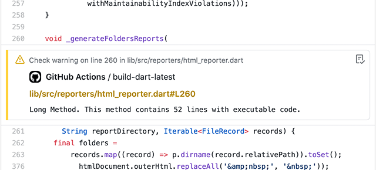

# GitHub reporter

Reports about design and static code diagnostics issues in pull requests based on GitHub Actions Workflow commands.

* Install dart/flutter and get packages:

  **Flutter example**

  ```yaml
  jobs:
    your_job_name:
      steps:
        - name: Install Flutter
          uses: subosito/flutter-action@master
          with:
            channel: stable
            
        - name: Install dependencies
          run: flutter pub get
        ...
  ```

  **Dart example**

  ```yaml
  jobs:
    your_job_name:
      steps:
        - name: Install Dart
          uses: dart-lang/setup-dart@v1
        
        - name: Install dependencies
          run: flutter pub get
        ...
  ```

* Run dart_code_metrics package:

  **`dart_code_metrics` is added to `dev_dependencies`**

  ```yaml
  - name: Run Code Metrics
    run: flutter pub run dart_code_metrics:metrics --reporter=github lib
    # OR
    # run: dart pub run dart_code_metrics:metrics --reporter=github lib
  ```

  **`dart_code_metrics` is not added to `dev_dependencies` (run as a global dependency)**

  ```yaml
  - name: Run Code Metrics
    run: flutter pub global activate dart_code_metrics && flutter pub global run dart_code_metrics:metrics --reporter=github lib
    # OR
    # run: dart pub global activate dart_code_metrics && dart pub global run dart_code_metrics:metrics --reporter=github lib
  ```

## Full Example

```yaml
jobs:
  your_job_name:
    steps:
      - name: Install Flutter
        uses: subosito/flutter-action@master
        with:
          channel: stable
          
      - name: Install dependencies
        run: flutter pub get

      - name: Run Code Metrics
        run: flutter pub run dart_code_metrics:metrics --reporter=github lib
```

---
Example of a report in a PR:



---
