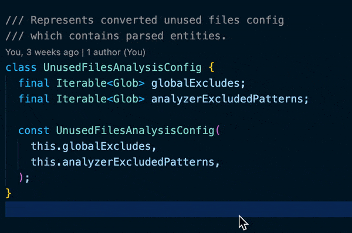

# Analyzer Plugin

Dart Code Metrics can be used as a plugin for the Dart [`analyzer`](https://pub.dev/packages/analyzer). All issues produced by provided rules or anti-patterns will be highlighted in IDE.

To enable the plugin integration add `dart_code_metrics` entry to the analyzer plugins list:

```yaml title="analysis_options.yaml"
analyzer:
  plugins:
    - dart_code_metrics

dart_code_metrics: ... # package configuration
```

Plugin integration supports all IDE that are supported by the analyzer itself.

## Applying quick fixes {#applying-quick-fixes}

Rules that marked with a `has auto-fix` badge have auto-fixes available through the IDE context menu. VS Code example:



## Troubleshooting the plugin integration {#troubleshooting-the-plugin-integration}

If you have a problem with the plugin, refer to the [troubleshooting docs](https://github.com/dart-code-checker/dart-code-metrics/blob/master/TROUBLESHOOTING.md).
