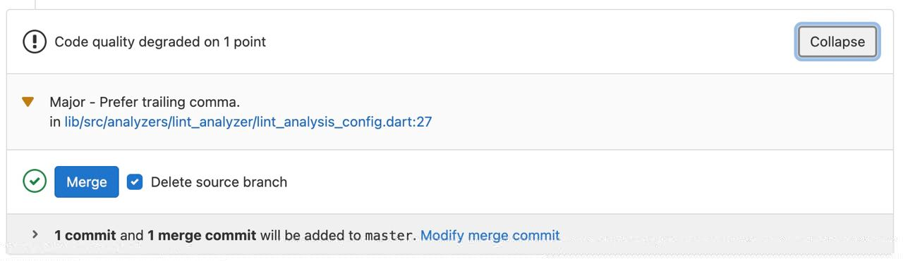
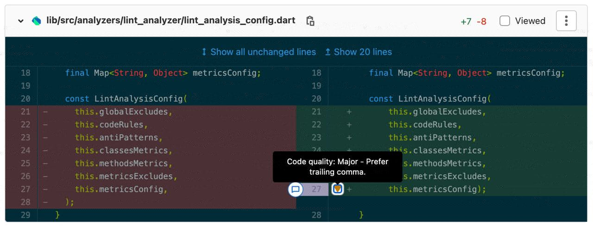

# Analyze

Reports code metrics, rules and anti-patterns violations. To execute the command, run

```sh
$ dart run dart_code_metrics:metrics analyze lib

# or for a Flutter package
$ flutter pub run dart_code_metrics:metrics analyze lib
```

Full command description:

```text
Usage: metrics analyze [arguments...] <directories>

-h, --help                                        Print this usage information.


-r, --reporter=<console>                          The format of the output of the analysis
                                                  [console (default), console-verbose,
                                                  codeclimate, github, gitlab, html, json]
-o, --output-directory=<OUTPUT>                   Write HTML output to OUTPUT
                                                  (defaults to "metrics/")


    --cyclomatic-complexity=<20>                  Cyclomatic Complexity threshold.
    --halstead-volume=<150>                       Halstead Volume threshold.
    --lines-of-code=<100>                         Lines of Code threshold.
    --maximum-nesting-level=<5>                   Maximum Nesting Level threshold.
    --number-of-methods=<10>                      Number of Methods threshold.
    --number-of-parameters=<4>                    Number of Parameters threshold.
    --source-lines-of-code=<50>                   Source lines of Code threshold.
    --technical-debt=<0>                          Technical Debt threshold.
    --weight-of-class=<0.33>                      Weight Of a Class threshold.
    --maintainability-index=<50>                  Maintainability Index threshold.

    --root-folder=<./>                            Root folder
                                                  (defaults to current directory)
    --sdk-path=<directory-path>                   Dart SDK directory path. 
                                                  Should be provided only when you run the application as compiled executable(https://dart.dev/tools/dart-compile#exe) and automatic Dart SDK path detection fails.
    --exclude=<{/**.g.dart,/**.template.dart}>    File paths in Glob syntax to be exclude
                                                  (defaults to "{/**.g.dart,/**.template.dart}")


    --no-congratulate                             Don't show output even when there are no issues.


    --set-exit-on-violation-level=<warning>       Set exit code 2 if code violations 
                                                  have the same or higher level
                                                  [none, warning, alarm]
    --[no-]fatal-style                            Treat style level issues as fatal.
    --[no-]fatal-performance                      Treat performance level issues as fatal.
    --[no-]fatal-warnings                         Treat warning level issues as fatal.
```

## Output example {#output-example}

### Console {#console}

Use `--reporter=console` to enable this format.


### HTML {#html}

Use `--reporter=html` to enable this format.

#### HTML report overview {#html-report-overview}


#### HTML single file report {#html-single-file-report}


#### HTML report details {#html-report-details}


### JSON {#json}

The reporter prints a single JSON object containing meta information and the violations grouped by a file. Use `--reporter=json` to enable this format.

#### The **root** object fields are {#the-root-object-fields-are}

- `formatVersion` - an integer representing the format version (will be incremented each time the serialization format changes)
- `timestamp` - a creation time of the report in YYYY-MM-DD HH:MM:SS format
- `records` - an array of [objects](#the-record-object-fields-are)
- `summary` - an array of [objects](#the-summary-record-object-fields-are) _(optional)_

```JSON
{
  "formatVersion": 2,
  "timestamp": "2021-04-11 14:44:42",
  "records": [
    {
      ...
    },
    {
      ...
    },
    {
      ...
    }
  ],
  "summary": [
    {
      ...
    },
    {
      ...
    }
  ]
}
```

#### The **record** object fields are {#the-record-object-fields-are}

- `path` - a relative path to the target file
- `fileMetrics` - an array with target file [metrics](#the-metric-value-object-fields-are)
- `classes` - a map with **class name** as the **key** and **[class report](#the-report-object-fields-are)** as the **value**
- `functions` - a map with **function name** as the **key** and **[function report](#the-report-object-fields-are)** as the **value**
- `issues` - an array of [issues](#the-issue-object-fields-are) detected in the target file
- `antiPatternCases` - an array of [anti-pattern cases](#the-issue-object-fields-are) detected in the target file

```JSON
{
  "path": "lib/src/metrics/metric_computation_result.dart",
  "classes": {
    ...
  },
  "functions": {
    ...
  },
  "issues": [
    ...
  ],
  "antiPatternCases": [
    ...
  ]
}
```

#### The **summary-record** object fields are {#the-summary-record-object-fields-are}

- `status` - a status of information in this record
- `title` - a message with information about the record
- `value` - an actual value of this record (can be an array or a single value)
- `violations` - a value of a violations count of a metric associated with this record

```JSON
{
    "status": "warning",
    "title": "Average Cyclomatic Number per line of code",
    "value": 0.3447098976109215,
    "violations": 5
}
```

#### The **report** object fields are {#the-report-object-fields-are}

- `codeSpan` - a source [code span](#the-code-span-object-fields-are) of the target entity
- `metrics` - an array with target entity [metrics](#the-metric-value-object-fields-are)

```JSON
{
  "codeSpan": {
    ...
  },
  "metrics": [
    ...
  ]
}
```

#### The **code span** object fields are {#the-code-span-object-fields-are}

- `start` - a start [location](#the-location-object-fields-are) of an entity
- `end` - an end [location](#the-location-object-fields-are) of an entity
- `text` - a source code text of an entity

```JSON
{
  "start": {
    ...
  },
  "end": {
    ...
  },
  "text": "entity source code"
}
```

#### The **location** object fields are {#the-location-object-fields-are}

- `offset` - a zero-based offset of the location in the source
- `line` - a zero-based line of the location in the source
- `column` - a zero-based column of the location in the source

```JSON
{
  "offset": 156,
  "line": 7,
  "column": 1
}
```

#### The **metric value** object fields are {#the-metric-value-object-fields-are}

- `metricsId` - an id of the computed metric
- `value` - an actual value computed by the metric
- `unitType` - a human readable unit type _(optional)_
- `level` - a level of the value computed by the metric
- `comment` - a message with information about the value
- `recommendation` - a message with information about how the user can improve the value _(optional)_
- `context` - an [additional information](#the-context-message-object-fields-are) associated with the value that helps understand how the metric was computed

```JSON
{
  "metricsId": "number-of-methods",
  "value": 14,
  "unitType": "methods",
  "level": "warning",
  "comment": "This class has 14 methods, which exceeds the maximum of 10 allowed.",
  "recommendation": "Consider breaking this class up into smaller parts.",
  "context": [
    ...
  ]
}
```

#### The **context message** object fields are {#the-context-message-object-fields-are}

- `message` - an message to be displayed to the user
- `codeSpan` - a source [code span](#the-code-span-object-fields-are) associated with or referenced by the message

```JSON
{
  "message": "getter complexityEntities increase metric value",
  "codeSpan": {
    ...
  }
}
```

#### The **issue** object fields are {#the-issue-object-fields-are}

- `ruleId` - an id of the rule associated with the issue
- `documentation` - an url of a page containing documentation associated with the issue
- `codeSpan` - a source [code span](#the-code-span-object-fields-are) associated with the issue
- `severity` - a severity of the issue
- `message` - a short message
- `verboseMessage` - a verbose message containing information about how the user can fix the issue (optional)
- `suggestion` - a [suggested](#the-suggestion-object-fields-are) relevant change (optional)

```JSON
{
  "ruleId": "long-parameter-list",
  "documentation": "https://git.io/JUGrU",
  "codeSpan": {
    ...
  },
  "severity": "none",
  "message": "Long Parameter List. This function require 5 arguments.",
  "verboseMessage": "Based on configuration of this package, we don't recommend writing a function with argument count more than 4.",
  "suggestion": {
    ...
  }
}
```

#### The **suggestion** object fields are {#the-suggestion-object-fields-are}

- `comment` - a human-readable description of the change to be applied
- `replacement` - a code with changes to replace original code with

```JSON
{
  "comment": "Add trailing comma",
  "replacement": "WeightOfClassMetric.metricId: (config) => WeightOfClassMetric(config: config),"
}
```

### GitHub {#github}

> **DEPRECATED!** This reporter is deprecated and will be removed in 5.0.0. You can migrate on our [GitHub Action](../integrations/github-action.md).

Reports about design and static code diagnostics issues in pull requests based on GitHub Actions Workflow commands. Use `--reporter=github` to enable this format.

- Install dart/flutter and get packages:

  **Flutter example**

  ```yaml
  jobs:
    your_job_name:
      steps:
        - name: Install Flutter
          uses: subosito/flutter-action@master
          with:
            channel: stable

        - name: Install dependencies
          run: flutter pub get
        ...
  ```

  **Dart example**

  ```yaml
  jobs:
    your_job_name:
      steps:
        - name: Install Dart
          uses: dart-lang/setup-dart@v1

        - name: Install dependencies
          run: flutter pub get
        ...
  ```

- Run dart_code_metrics package:

  **`dart_code_metrics` is added to `dev_dependencies`**

  ```yaml
  - name: Run Code Metrics
    run: flutter pub run dart_code_metrics:metrics --reporter=github lib
    # OR
    # run: dart pub run dart_code_metrics:metrics --reporter=github lib
  ```

  **`dart_code_metrics` is not added to `dev_dependencies` (run as a global dependency)**

  ```yaml
  - name: Run Code Metrics
    run: flutter pub global activate dart_code_metrics && flutter pub global run dart_code_metrics:metrics --reporter=github lib
    # OR
    # run: dart pub global activate dart_code_metrics && dart pub global run dart_code_metrics:metrics --reporter=github lib
  ```

#### Full Example {#full-example}

```yaml
jobs:
  your_job_name:
    steps:
      - name: Install Flutter
        uses: subosito/flutter-action@master
        with:
          channel: stable

      - name: Install dependencies
        run: flutter pub get

      - name: Run Code Metrics
        run: flutter pub run dart_code_metrics:metrics --reporter=github lib
```

Example of a report in a PR:


### GitLab {#gitlab}

Reports about design and static code diagnostics issues in merge requests based on Code Quality custom tool. Use `--reporter=gitlab` to enable this format.

- Define a job in your `.gitlab-ci.yml` file that generates the [Code Quality report artifact](https://docs.gitlab.com/ee/ci/yaml/index.html#artifactsreportscodequality).

```yaml
code_quality:
  image: google/dart
  before_script:
    - dart pub global activate dart_code_metrics
  script:
    - dart pub global run dart_code_metrics:metrics analyze lib -r gitlab > code-quality-report.json
  artifacts:
    reports:
      codequality: code-quality-report.json
```

Example of a Code Quality widget in a PR:



Example of a Code Quality in a PR diff view:


